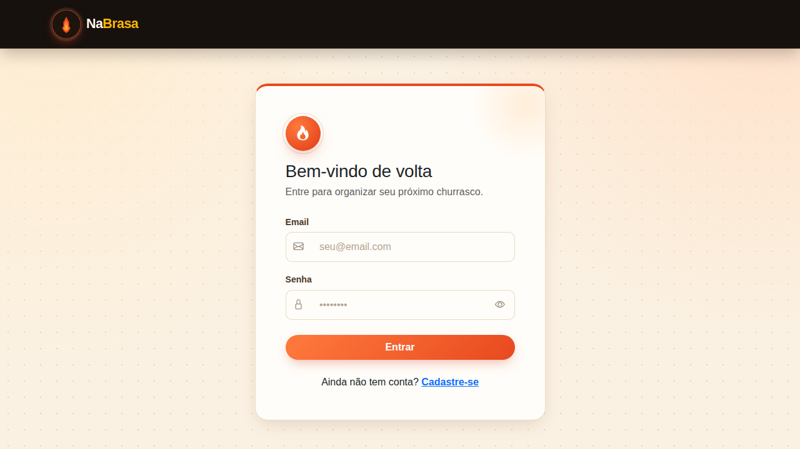
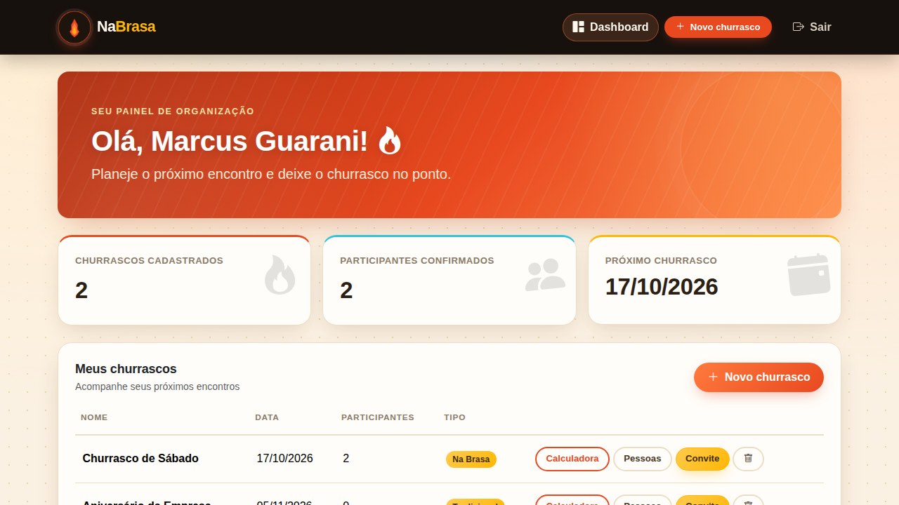
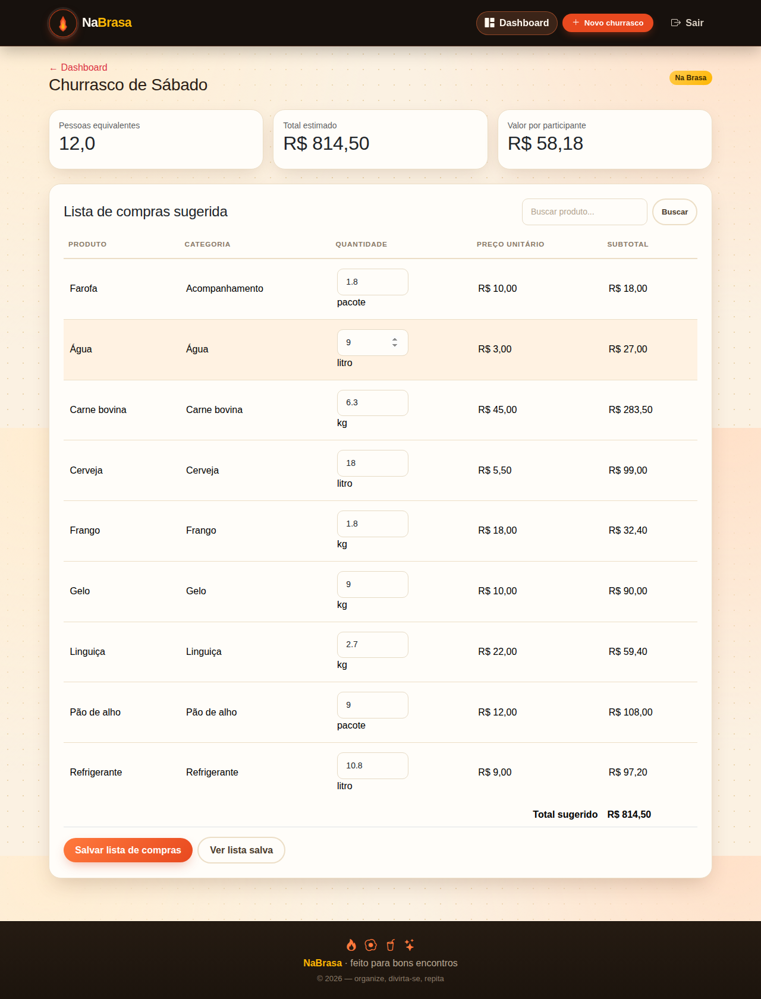
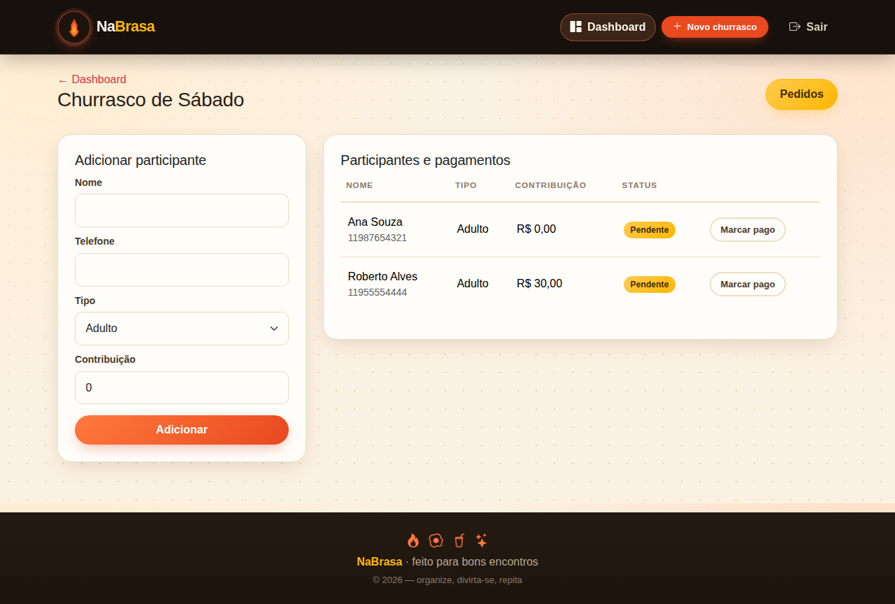
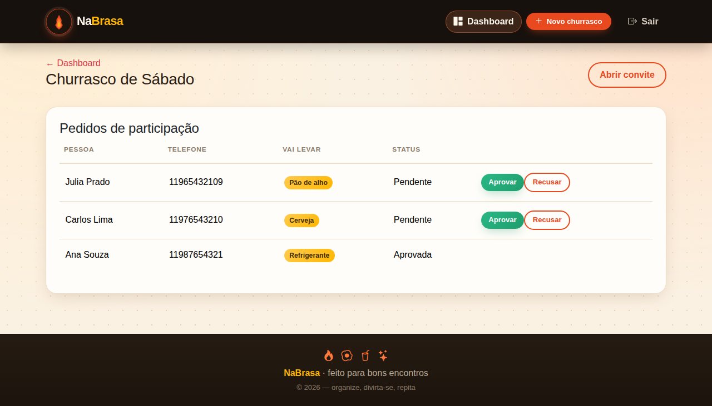
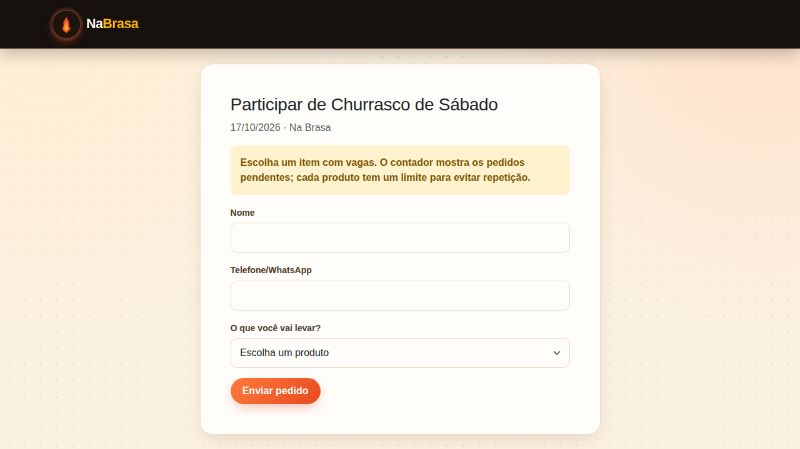

<div align="center">


# 🔥 NaBrasa

**Organize seu churrasco do início ao fim: calcule a quantidade certa de comida e bebida, controle quem já pagou e deixe os convidados escolherem o que vão levar.**


</div>

---

## 📋 Sobre o projeto

O **NaBrasa** resolve o maior problema de quem organiza um churrasco: descobrir *quanto* comprar e *quem* vai trazer o quê. Você informa o número de adultos e crianças, a duração do evento e o estilo do churrasco (econômico, tradicional ou na brasa), e o sistema calcula automaticamente a lista de compras com quantidades e custo estimado por item.

Cada evento também gera um **link de convite público**, onde os convidados — sem precisar de login — escolhem um item para levar (bebida, carne, acompanhamento...), respeitando um limite por produto para evitar repetição. O organizador aprova ou recusa cada pedido, e acompanha os pagamentos de cada participante em um painel só dele.

## ✨ Funcionalidades

- 🔐 **Cadastro e login** com senha criptografada (`password_hash`)
- 🧮 **Calculadora inteligente** — crianças contam como meia pessoa, e o tipo/duração do evento ajustam as quantidades automaticamente
- 🔍 **Busca de produtos** na lista de compras
- 🛒 **Lista de compras salva** com quantidade, preço unitário e subtotal por item
- 👥 **Gestão de participantes** — adicione manualmente ou aprove pedidos recebidos pelo convite público
- 💸 **Controle de pagamentos** por participante (pago / pendente)
- 🔗 **Convite público** — convidados escolhem o que vão levar, sem precisar criar conta
- ✅ **Aprovação de pedidos** — o organizador decide quem entra na lista
- 🗑️ **Exclusão de churrascos** com confirmação e limpeza em cascata dos dados relacionados
- 🛡️ Proteção **CSRF** em todos os formulários autenticados

## 🖼️ Capturas de tela

<table>
<tr>
<td width="50%">

**Login**


</td>
<td width="50%">

**Dashboard**


</td>
</tr>
<tr>
<td width="50%">

**Calculadora e lista de compras**


</td>
<td width="50%">

**Participantes e pagamentos**


</td>
</tr>
<tr>
<td width="50%">

**Pedidos de participação**


</td>
<td width="50%">

**Convite público**


</td>
</tr>
</table>

## 🛠️ Tecnologias

| Camada | Tecnologia |
|---|---|
| Backend | PHP 8.3 (`declare(strict_types=1)`, PDO com prepared statements) |
| Banco de dados | MySQL 8.4 |
| Frontend | Bootstrap 5.3 + Bootstrap Icons |
| Infraestrutura | Docker + Docker Compose |
| Servidor web | Apache (imagem `php:8.3-apache`) |

## 🚀 Como rodar localmente

### Pré-requisitos
- [Docker](https://www.docker.com/) e Docker Compose instalados (o Docker Desktop já traz os dois)

### Passo a passo

```bash
# 1. Clone o repositório
git clone https://github.com/<seu-usuario>/na-brasa.git
cd na-brasa

# 2. Suba os containers (build da imagem PHP + MySQL)
docker compose up -d --build

# 3. Acesse
# http://localhost:8080
```

O banco de dados é criado e populado automaticamente no primeiro `up` (schema + produtos padrão como carne, linguiça, frango, cerveja, refrigerante, etc.), graças ao volume que monta `database/schema.sql` no `docker-entrypoint-initdb.d` do MySQL.

Para parar:
```bash
docker compose down          # mantém os dados
docker compose down -v       # apaga também o volume do banco
```

## 📁 Estrutura do projeto

```
NaBrasa/
├── assets/              # CSS, imagens e a logo
├── config/              # Conexão com o banco (PDO)
├── database/            # schema.sql — estrutura das tabelas + seed de produtos
├── docs/screenshots/    # Imagens usadas neste README
├── functions/           # Regras de negócio (calculadora, filtro de produtos)
├── includes/            # Autenticação, header/footer/navbar compartilhados
├── pages/                # Telas autenticadas (calculadora, participantes, pedidos...)
├── public/               # Webroot: login, cadastro, dashboard, convite público
├── docker-compose.yml
└── Dockerfile
```

## 🗺️ Roadmap

- [ ] Editar dados de um churrasco já criado
- [ ] Exportar a lista de compras em PDF
- [ ] Notificação por WhatsApp quando um pedido for aprovado

## 📄 Licença

Este projeto está disponível para uso pessoal e educacional. Sinta-se à vontade para clonar, estudar e adaptar.

---

## 👨‍💻 Autor

Feito com 🔥 por **Marcus Guarani**

[](https://github.com/marcusguarani)
[](https://www.linkedin.com/in/marcusguarani)
[](https://marcusguarani.com.br)

